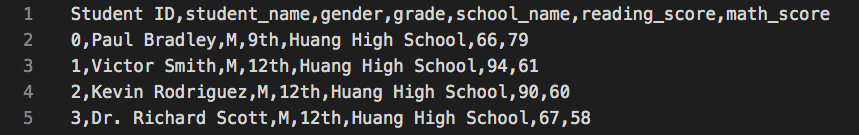
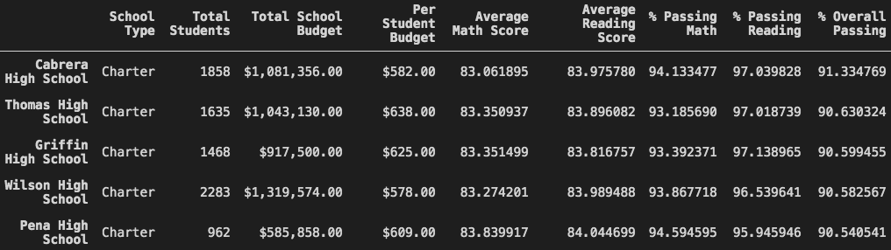

# **School District Analysis**  

## **Overview of Project**
in this project we are helping our client to  analyze the data of the high schools and their students in a district    

### **Purpose**
We have been provided with two tabular data files ([schools_complete.csv](Resources/schools_complete.csv) and [students_complete.csv](Resources/students_complete.csv)). a part of these file are shown in the images below:

|*schools_complete*|
:--:
||
&nbsp;
|*student_complete*|
:--:
||

&nbsp;
we can find the name of the schools, their type, number of students of each school and their budget in school file, while in the student file we have the following information: student names and their gender, what grade trey are in, their school name and their reading and math scores.  
we used the data we had in these files to perform some analysis and provide our client with the following information:

- A high-level snapshot of the district's key metrics, presented in a table format
- An overview of the key metrics for each school, presented in a table format
- Tables presenting each of the following metrics:
  - Top 5 and bottom 5 performing schools, based on the overall passing rate
  - The average math score received by students in each grade level at each school
  - The average reading score received by students in each grade level at each school
  - School performance based on the budget per student
  - School performance based on the school size 
  - School performance based on the type of school

After completing the analysis, we were told that the student file shows evidence of academic dishonesty; specifically, reading and math grades for Thomas High School ninth graders appear to have been altered. As per client request we needed to remove the altered data and repeat the analysis. the change in the results will be discussed in the conclusion section of this report

## **Results**  

### **Analysis**
To perform this analysis we used Jupyter notebook, Python and pandas library. First we read the source files ([schools_complete.csv](Resources/schools_complete.csv) and [students_complete.csv](Resources/students_complete.csv)) and load them into pandas data frames:

|*school_data_dataframe*|
:--:
||
&nbsp;
|*student_data_dataframe*|
:--:
||

&nbsp;
Then we searched for any missing or invalid data. there were no missing values in data frames, but as you can see in "student_data_datafarme" there is a student name with "Dr." as prefix, so we had to search the data for any names containing a prefix or suffix and correct the value. the file "[cleaning_student_names.ipynb](cleaning_student_names.ipynb)" contains the code we wrote to clean the student data frame.  
In the next step using ".merge" method in pandas we tried to create a unified data frame as below (called: "school complete data):
&nbsp;

&nbsp;

&nbsp;

For the rest of the code we used different functions and methods of Pandas library on these data frames (creating new data frames and series, grouping based on values of a column,  performing operation on the columns of the data frames and series, formatting the values of the data frames and ...) to  analyze the data and get the results we needed. our code for the first part of this analysis (before removing the altered data) can be found in: "[PyCitySchools.ipynb](PyCitySchools.ipynb)" 

As mentioned before, the client asked us to remove the math and reading scores repeat the analysis for the students in ninth grade in Thomas high school. we did so by using ".loc" and ".nan" methods in  Pandas and Numpy on "student_data_dataframe" to filter the data for math and reading scores for nine graders in Thomas high school and then and set them equal to " nan " after that we merged the data frames and repeated the whole process again, except, for calculating the values of some of the columns (especially where we wanted to calculate the percentage of the number of the students who passed math, reading or both) we had to find the new number of the students to use in our formulas.We also provided the client with a file containing our code for this analysis: "[PyCitySchools_Challenge.ipynb](PyCitySchools_Challenge.ipynb)"

### **Conclusion**
Here, we are going to compare the results of our first analysis and the one we performed after removing some data from the source, and see how it affected the results:

- District summary
    - to perform this analysis we had to use the new total number of students for the whole district by subtracting the number of nine graders in thomas high school from the previous total number we had to calculate the new percentages of the number of students passed their courses
    - in the images below, we can see that there is no change in the total budget as it is independent from the number of students but there are some slight changes in average scores and passing percentages as we set some of the values to "nan" and changed the total number of students (for calculating the percentages) 

        

        |*Original Analysis*|
        |:--:|
        ||
        
        |*After Removing Thomas High School nine graders scores*|
        :--:
        ||
        

&nbsp;
- School summary
    - As it can bee seen in the below images the changes we made only affected the results for thomas high school itself, there is only a slight change in the average scores for math and reading and also in passing percentages
    -  For this analysis again we had to alter the total number of students of the thomas high school and just take the number of students in 10th, 11th and 12th grade into consideration to calculate the correct passing percentages, then we replaced their values in the data frame with the new ones

        

        |*Original Analysis*|
        |:--:|
        ||

        |*After Removing Thomas High School nine graders scores*|
        :--:
        ||
        

&nbsp;
- Schools performance
    - In this analysis performance of each school is evaluated by its overall passing percentage (calculated based on those who passed both math and reading). We sorted the data frames for school results in descending order for "% Overall Passing" to get the top five school
    - we can see that there is no change in the ranking of the schools and Thomas high school has still in the second place even after we changed tha data
        

        |*Original Analysis*|
        |:--:|
        ||

        |*After Removing Thomas High School nine graders scores*|
        :--:
        ||
        

&nbsp;
- Math and reading score for each school
    - in our analysis we presented two tables showing the averages of math and reading scores for each grade in each school
    - The only thing that changed in both tables after altering the source data is the result for the ninth grade in Thomas high school which is changed to " nan " (see images below)
        

        |*Original Analysis (Average Math Grade)*|
        |:--:|
        ||

        |*After Removing Thomas High School nine graders scores (Average Math Grade)*|
        :--:
        ||
        
 

        

        |*Original Analysis (Average Reading Grade)*|
        |:--:|
        ||

        |*After Removing Thomas High School nine graders scores (Average Reading Grade)*|
        :--:
        ||
        
         

&nbsp;
- Schools performance based on different factors
    - Budget 
        - The first factor we want to see how affects the performance of the school is their budget per student. we defined four bins for this parameter and determined the schools belonged to each group. Then we performed the analysis for the data in each group(".group" method in pandas can help a lot to perform such an analysis) 
        - The Thomas high school belongs to the group "$630-644". Apparently, the change in the data did not affect the results of this analysis. But that is not true, there are some changes in the results but they are so small. and when we rounded the values in the table to 1 or no decimal places (as per client request) we actually ignored that difference.
            

            |*Original Analysis*|
            |:--:|
            ||

            |*After Removing Thomas High School nine graders scores*|
            :--:
            ||
            

        - Lets take a look at the results before rounding the values to see how the results were affected by changing the source data as you can see the difference is in the decimal part of the numbers:
            

            |*Original Analysis*|
            |:--:|
            ||

            |*After Removing Thomas High School nine graders scores*|
            :--:
            ||
            

             &nbsp;
    - School size
        - we repeated the previous analysis for the school size, by that we mean the number of the students for each school. We divided the schools into three sizes:
            

            |*Original Analysis*|
            |:--:|
            ||

            |*After Removing Thomas High School nine graders scores*|
            :--:
            ||
            

        - Thomas high school is in the "medium(1000-2000)" group. here again we can not see the change in the results after altering the source data for the same reason we described before (rounding the values).
    - school type
        - Here we performed another analysis to evaluate how being a charter or district school would affect the performance of the schools. Images below show the result of this analysis
            

            |*Original Analysis*|
            |:--:|
            ||

            |*After Removing Thomas High School nine graders scores*|
            :--:
            ||
            

        - Thomas high school is a charter school. here again we can not see the change in the results after altering the source data for the same reason we described before (rounding the values).

## **summary**  

Here is what happened to the results after we replaced reading and math scores for the ninth grade at Thomas High School with NaNs:
- there is a "nan" value for ninth grad in Thomas school in the tables that shows the average math and reading scores for each grade in each school  
- in the school summary tables, where the key metrics are shown for each school in the district, a slight change occurred in the results for Thomas high school (in average scores and passing percentages)
- we can see a small difference between the results in the district summary tables which contain the key metrics for the whole district
- Also there are small changes in the results of the groups, that Thomas High school belongs to, in the analysis of school performance based on their budget, size and type.
- the reason we can not see some of the changes we mentioned, in the images we presented in this report, is that we rounded the values in the tables to 1 or no decimal places (as per client request) 
